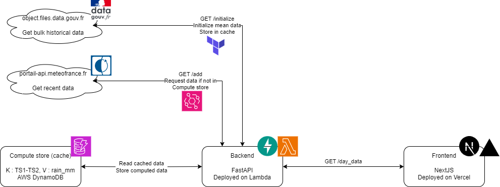

# Rain o Meter

## Introduction

_Have you ever wondered how much has it rained in the past few days ? And if it really is that much compared to average data ?_

Well, I have, so I am building this application to answer these questions.

The ultimate goal of this application is to publicly expose a hex map of France with recent rain indicators.

The MVP goal is to expose indicators of how much has it rained yesterday in Paris (where I live), in the current month and in the past 31 days compared to 1990-2020 average data.

To achieve this, I use MeteoFrance data now publicly available through APIs, and stored on data.gouv.fr for historical data.

While building this application, I also added clean code practises where I could, to showcase this for a personal portfolio. Please have a look :)

## Architecture goal

## Current state of things

1. Add exploration notebooks ✓
2. Add API backend on FastAPI
    1. Add uv, ruff, taskipy ✓
    2. Add asynchronous FastAPI source code ✓
    3. Add unit tests ✓
    4. Add docker compose for local integration testing ✓
    5. Test deployment on AWS
    6. Add CI for quality & test jobs
3. Add infra code on Terraform to deploy backend on a lambda with a private URL
4. Add small front in React TS 
    1. Add front source code
    2. Deploy front using Terraform and Vercel

## Components

All components of my work are made to be easily launched and reused locally, with the correct setup.

Please have a look in README.md files in separate folders to get clear instructions on how to replicate the application.

### Backend

This is the core of the application, relying on python FastAPI to work.

You can make it work locally with python, uv, docker and docker compose.

More infos in [Readme file](backend/README.md).

### Notebooks

This is the initial data exploration to sort MeteoFrance data, which isn't trivial to request.

You can launch it again locally with python.

More infos in [Readme file](notebooks/README.md).
